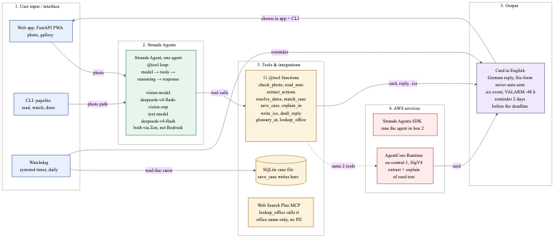
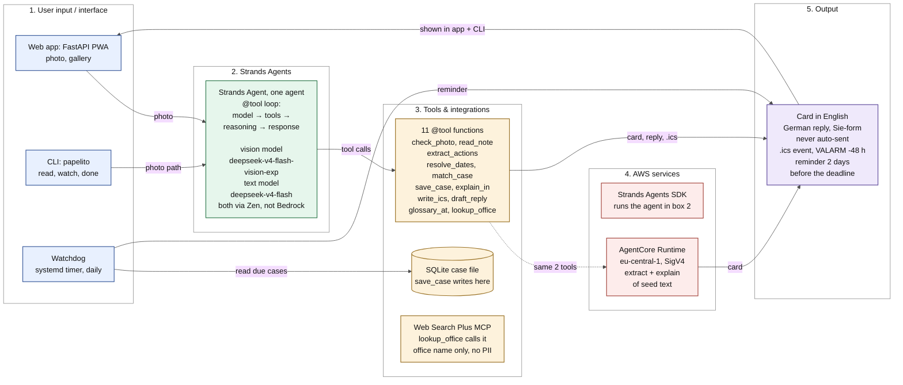

# Papelito

Papelito turns Austrian kindergarten paper notes into ongoing cases. Papelito is built with Strands Agents. It reads a photo, explains the note in English, prepares a formal German reply to copy, creates an `.ics` calendar entry with a 48-hour alarm, and tracks later amendments to the same case. It never sends a reply and never invents a deadline.

Papelito is an Everyday Agents entry for Agents for Humans (AWS). MIT licensed.

## Why not one more scan-and-translate app

At least a dozen apps photograph a German letter and explain it. They summarize, translate, draft a reply, offer a calendar tap. Then they stop. The Kindergarten does not stop. A second slip arrives on Wednesday: "moved to Friday, bring rain boots, confirm by tomorrow." The calendar entry from Monday is now wrong and nothing tells you.

Papelito is different in four ways, and the first two are the whole point.

**A case, not a scan.** One Kindergarten event is one case, and a case lives across several pieces of paper. When the follow-up note arrives, the agent recognises it as an amendment to the open case instead of a new one. Papelito replaces the calendar entry, re-drafts the German reply, moves the reminder, and shows the old items struck through so you can see what changed.

**It keeps working after the phone is face down.** A watchdog runs once a day. For every open case with a deadline within two days and no reply marked sent, it writes an English reminder and marks the case "due". It nags until you tap done. Reads once, acts for weeks. It never sends the German reply.

**Two artifacts in two languages from one photo.** The explanation is in English. The reply is in German, in Sie-form, with the names from your household profile filled in. Papelito never shows a translation without an action next to it.

**Austrian Kindergarten paper.** The glossary explains terms such as MA, Gemeinde, Hort, Elternverein and Jänner. The reply register also changes with the sender type.

And one rule that shapes everything: the agent never sends anything. It drafts the reply, you copy it. It sets the reminder, you tap done.

## What you see: the card

Every photo becomes a card with four columns. The fourth column is the product. Its checkmarks appear one by one as the tools run.

```
what                       what to do                      by when                  done for you
Tiergarten field trip      8 € in cash in an envelope      Mon 7 Sep 2026          ✓ calendar entry, alarm Sat 5 Sep
                           for Fr. Huber                   "by Monday"              ✓ German reply ready
                                                                                   ✓ reminder Sat 5 Sep
```

The app renders the labels and card copy in English.

Every deadline on the card links to the crop of the German sentence it came from. A date or amount extracted with low confidence does not become a calendar entry. The card shows the crop and asks one question. Below a threshold no artifact is created at all. Papelito would rather ask than invent a deadline.

## The quiet machine

Papelito is one Strands agent with plain Python tools. The agent loop decides which tool to call next. Every tool that produces a deadline carries the German source sentence with it, so nothing on the card is unsourced.

```python
@tool
def resolve_dates(phrase: str, received_on: str) -> str:
    """'bis Freitag', 'innerhalb von 14 Tagen' -> ISO date. Deterministic, no model call."""
```

The tools, in the order a first photo usually hits them:

- `check_photo` rejects blur, glare and clipped text before a model call is spent.
- `read_note` reads the photo with a vision model and returns text plus a line list.
- `extract_actions` returns actions, each with deadline, amount, source line and confidence.
- `resolve_dates` turns a relative deadline such as "by Friday" into a date from the day the note was received. Pure Python, no model.
- `match_case` is the amendment reconciler. It decides whether these actions belong to an open case or start a new one.
- `explain_in` writes the card in English.
- `write_ics` writes one VEVENT per action with an alarm 48 hours before.
- `draft_reply` writes the German reply in the register that fits the sender. A Kindergarten gets a different tone than a Magistratsabteilung.
- `glossary_at` explains Austrian terms from a static, cited list.
- `lookup_office` is a small sub-agent. It finds what an office is, where it is and its phone number through the Web Search Plus MCP server, with identifiers stripped from the query first.
- `save_case`, `mark_replied`, `list_open`, `delete_case` are the case file, a SQLite database on your machine.

The watchdog is `papelito watch`, run daily by a systemd timer. It opens the case file, finds every open case with a deadline within two days and no reply marked sent, writes an English reminder from a template, and marks that case due. Set `PAPELITO_WATCH_AGENT=1` to hand each due case back to the Strands agent instead. The reminder shows up in the web app. After the deadline passes, it asks once in English whether the reply was sent, then closes the case. It never sends mail or Telegram.

Models: a vision model for reading, a text model for everything else, both through an OpenAI-compatible gateway. Household photos leave the machine only for that vision call.

The same extract and explain tools also run on Amazon Bedrock AgentCore Runtime in `eu-central-1`, as a sidecar. One invocation: seed **text** in, four-column card out. No photos, no SQLite, no watchdog. The PWA calls it with IAM SigV4 from `POST /api/demo/agentcore`. Judges click the web page, not the Runtime. The household timer stays systemd.

## Architecture



Five boxes, the ones the Agents for Humans FAQ asks for: user input/interface, Strands Agents, tools & integrations, AWS services, output. Source: [`docs/architecture.mmd`](docs/architecture.mmd).



## Setup

Python 3.10 or newer and [`uv`](https://docs.astral.sh/uv/). You need an API key for the OpenAI-compatible Zen gateway (`https://opencode.ai/zen/go/v1`). The household pipeline does not use AWS. The optional AgentCore sidecar runs in `eu-central-1`.

```bash
git clone https://github.com/robbyczgw-cla/papelito.git
cd papelito
uv sync
```

Set `PAPELITO_ZEN_KEY` or `ZEN_API_KEY` through your shell or secret manager. Create the local profile from the supplied example and use synthetic names for a demo.

Run the mobile page. Photograph a note, or upload one already on the phone:

```bash
uv run uvicorn web.app:app
```

Open the address printed by the server. To fill the list without a photo, send `POST /api/demo/seed`.

CLI, if you already have a photo. `--received` is the day the paper came out of the schoolbag, because a relative deadline such as "by Friday" means nothing without it.

```bash
uv run papelito add <demo-image> --received 2026-09-03
uv run python -m papelito.watch --today 2026-09-10
uv run papelito done <case-id>
```

The watchdog timer units live in `deploy/`. Web Search Plus credentials are optional; `lookup_office` is the only tool that uses them.

## Disclosure

This repository was written during the Submission Period (starting 2026-09-03). AI coding assistants (Grok, Claude, Codex) were used to write new code. That is allowed.

The only pre-existing work incorporated is **Web Search Plus**, an MCP server published on PyPI as `web-search-plus-mcp` before this hackathon. The `lookup_office` sub-agent attaches it as a stdio MCP client through the Strands `MCPClient`. Child names, addresses, phone numbers and the household profile are stripped from the search query before that call. Everything else in this repository is new.

## Privacy

Kindergarten notes may contain children's names and other personal data.

- Photos stay on your machine. The only place a photo goes is the model call that reads it. Crops of source sentences are stored locally next to the case.
- The reply draft sends the names from your profile to the text model, because the reply needs them. Nothing else about the household leaves the machine.
- Web lookups strip identifiers before the query. The search sees an institution name, never the child's name, your address or anything from the note body.
- Delete really deletes. `delete_case` removes the row, the photo, the crops, the `.ics` and the reply draft. There is no archive and no soft delete.
- No credentials, local hostnames, real household names or real household photos live in the repository. `profile.example.yaml` has placeholders.

## Limitations

- German paper only, Austrian by default. The glossary and the reply register are tuned for Austria. Papelito will read a letter from a German tax office, but the glossary will not help you.
- English is the tested reader language. The formal reply remains German.
- Handwriting reads worse than print. The confidence gate will ask you more often.
- Date resolution is deterministic on purpose. It handles the common phrasings on Kindergarten paper. An unusual one falls through to the confidence gate instead of being guessed.
- The watchdog is a systemd timer, so the machine that runs it has to be on.
- Browser notifications depend on the browser and the phone. The in-app "due" state is the reminder you can rely on.
- The agent drafts, it does not send. That is a decision, not a gap.
- Papelito reads paper. It is not a lawyer, and it does not know your Kindergarten's unwritten rules.

## License

MIT.
