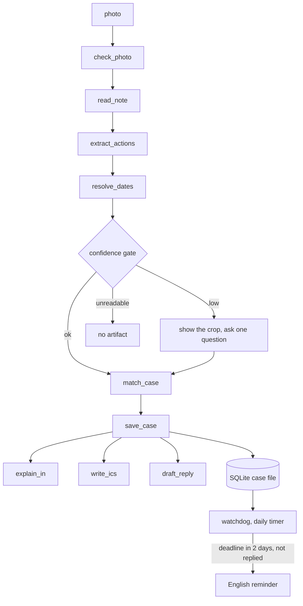

Agents for Humans: how Papelito's Strands agent is wired, tool by tool

Papelito reads Austrian Kindergarten paper, opens a case, and reminds the parent in English two days before the deadline. The first post explains why that requires a case file and a watchdog rather than a translation app. This post covers the implementation, with code from the public repo at https://github.com/robbyczgw-cla/papelito.

## One agent, fourteen tools

Papelito is built with Strands Agents, version 1.54.0 at the time of writing. There is one `Agent`, a list of plain Python functions decorated with `@tool`, and a system prompt that tells the model the order to call them in for a new photo. The agent loop picks the next call.

```python
# papelito/agent.py
TOOLS = [check_photo, read_note, extract_actions, resolve_dates, match_case, save_case, explain_in, write_ics,
         draft_reply, glossary_at, lookup_office, mark_replied, list_open, delete_case]

def build_agent(hooks=None, callback_handler=None, store=None, profile=None, use_models=True) -> Agent:
    configure(store=store, profile=profile, use_models=use_models)
    _, text = _models()
    return Agent(model=text, tools=TOOLS, system_prompt=SYSTEM_PROMPT, name="papelito",
                 callback_handler=callback_handler, hooks=hooks or [])
```

The models are `OpenAIModel` instances pointed at an OpenAI-compatible gateway: a vision model for reading and a text model for everything else. Strands defaults to Bedrock when no model is passed, so Papelito always passes one. The third post explains that model choice.

An in-process dictionary cuts token use. It shares the current note between tools and keys it by `paper_id`, the hash of the note text. `read_note` returns the id, and every later tool takes the id instead of the text. The model passes a short string instead of copying the complete German note into each call.



## The tools in the order a first photo hits them

**check_photo** runs before any model call. It is Pillow, not a model. Standard deviation of the edge image checks blur, the share of pixels above 250 checks glare, and the darkness of a 3 percent border catches a slip that runs off the frame. A blurry demo photo gets "blurry: hold still or move closer" and the vision call is never spent.

**read_note** is a second, tiny Strands agent with the vision model and a system prompt that says one line per printed line, keep umlauts and amounts verbatim, write `[unleserlich]` for anything unreadable, no commentary. Vision needs at least 2000 output tokens through this gateway or the transcription truncates.

**extract_actions** is where the model proposes and Python verifies. Each action comes back with a kind, a deadline, an amount, the German source line and a confidence. Deterministic checks then look the source line up in the transcription, run the date parser, and regex the amount. A failed check lowers the confidence. Above 0.75 the artifact is created. Between 0.4 and 0.75 the card shows the crop and asks one question. Below 0.4 nothing is created. The thresholds are at the top of `papelito/extract.py`.

**resolve_dates** has no model in it at all.

```python
@tool
def resolve_dates(phrase: str, received_on: str) -> dict:
    """Deterministically resolve a German date phrase ("bis Freitag", "innerhalb von 14 Tagen", "17.09.") to ISO."""
    return {"phrase": phrase, "iso": _extract.resolve_date(phrase, received_on)}
```

For synthetic German source text, the parser in `papelito/dates.py` handles phrases such as `Jänner` (January, the Austrian form), `übermorgen` (the day after tomorrow), `nächste Woche Freitag` (next week Friday) and `innerhalb von 14 Tagen` (within 14 days). `Bis Freitag`, "by Friday", resolves to the next Friday on or after the received date, which is why every command takes `--received`. `Montag oder Dienstag`, "Monday or Tuesday", returns a structured miss called `ambiguous` instead of a guess. The card asks instead of putting a guessed date in the calendar.

**match_case** is the amendment reconciler and required the most iteration. It scores the new paper against every open case. Same sender is worth 0.3. Shared event words like "Ausflug" (outing) or "Elternabend" (parents' evening) are worth up to 0.3. Shared tokens add up to 0.2. A matching date adds 0.25, a date within two weeks adds 0.12. Amendment words like "verschoben" (moved), "entfällt" (cancelled) or "Nachtrag" (addendum) add 0.15 once there is already some signal. Above 0.6 it is the same case. Below 0.35 it is a new case. In between, the text model gets the top three candidates and the new note and answers with a case id or null. The scoring trail is stored with the case.

**save_case** either creates a case or applies the amendment. Old actions of the same kind become superseded and stay visible struck through. The calendar, reply and card artifacts are marked stale so the agent regenerates them.

**write_ics** writes one VEVENT per active action with a deadline. The alarm is `-P2D` for all-day events and `-PT48H` for timed ones. The event description carries the German source sentence. The tool skips a Tagesablauf (daily schedule) with only clock times, because a daily schedule is not an appointment.

**draft_reply** writes the German answer in Sie-form. The register comes from the sender type: warm for a Kindergarten, Hort or Elternverein, letter form with a subject line for a Gemeinde or Magistrat, a short confirmation for a doctor. Names come from approved profile fields, never from the note. An optional fluency pass through the text model is rejected if a number, a name or the Sie-form went missing. The tool skips when the paper only informs.

**explain_in** writes the four-column card in English. A German sentence with no translation is quoted, never pasted raw into the do-column.

**glossary_at** is a static, cited list of Austrian terms. **lookup_office** is the one sub-agent. It strips names, addresses and profile fields out of the query, then runs a small Strands agent over the Web Search Plus MCP server. `MCPClient` attaches it over stdio with only `web_search` and `web_extract` allowed. That MCP server predates the hackathon and is disclosed in the README. Everything else is new.

## Two ways in, one set of tools

The CLI runs the real Strands loop. `papelito add <demo-image> --received 2026-09-03` builds the agent with a hook that prints each tool as it fires. The web upload runs the tools in a fixed order instead. It calls `process_photo`, which runs the same tool functions one after another and reports each one through an `on_step` callback so the page can fill the fourth column live. Both paths use the same tools and case file. The fixed order keeps the mobile demo repeatable.

The text model defaults to chain-of-thought, and on the extraction prompt that meant 30.8 seconds and 4,500 output tokens per round. Setting `reasoning_effort` to none gave the same JSON in 3.3 seconds and 225 tokens. A full first photo now takes about 19 seconds end to end.

## The watchdog does not need a model

`papelito watch` runs daily from a systemd user timer. It lists open cases, finds those with a deadline inside two days and no reply marked sent, composes the reminder line and marks the case due. The default line is deterministic, so the timer works with no model key configured. An optional `PAPELITO_WATCH_AGENT=1` mode asks a Strands agent to reword the line, then checks that every digit from the original survived.

```python
if out and set(re.findall(r"\d+", line)) <= set(re.findall(r"\d+", out)) and len(out) < 240:
    return out
return line
```

If the model drops the 8 or the date, the plain line wins.

The Gate 3 test in `tests/test_watch.py` is the sequence from the video: fake clock two days before the deadline, one run, exactly one English reminder. Mark done. Run again. Nothing.

Next step: record that sequence for the demo video.
